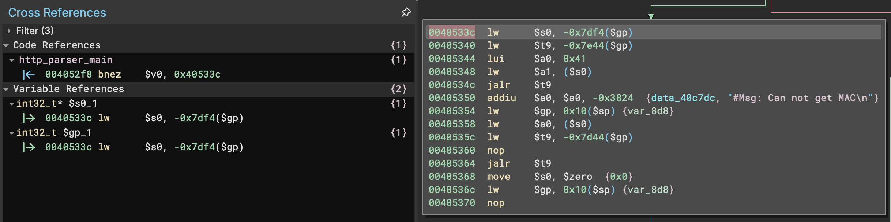
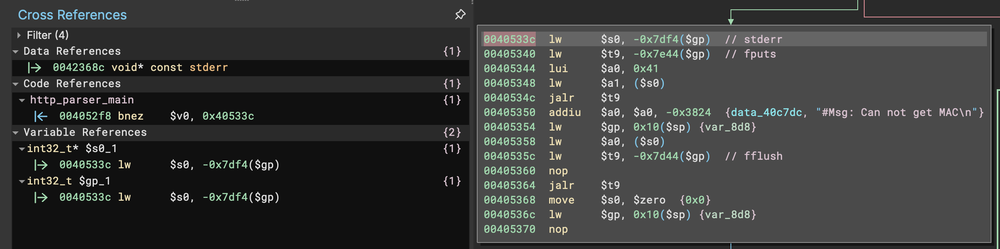

# BinaryNinja - Recover Import Cross-References (MIPS32)

It appears that the disassembler is losing track of xrefs based on offsets from $gp when the value in $gp is saved to the stack and later loaded back from the stack. This functionality appears to have broken in build 4469, last working correctly in build 4468.


## Usage

With the binary ninja python API installed, execute `./gprecovery.py $PATH_TO_BINARY`.  Logs will be written to `binja.log` with a `gprecovery` tag.  Two bndbs will be produced - one with the default analysis (`$filename_default_analysis.bndb`) and one saving the bndb with the annotations provided by this script (`$filename_after_analysis.bndb`).

This script was a complete minimal effort to restore this functionality and is by no means any level of good.  There are almost certainly better ways to do this and probably much better APIs that I am not taking advantage of.  I just needed something to quickly restore some sanity to my automated analysis and triage efforts.


## Screenshots


### Before



### After



## Log Sample

```
[0:8604061504 gprecovery info] Processing 'httpd'
[0:8604061504 gprecovery info] Found canonical $gp at: 0x42b480
[0:8604061504 gprecovery info] Candidates for gp-based offset reference recovery:
[0:8604061504 gprecovery info] 0x4021d4 lw      $s0, -0x7df4($gp)
[0:8604061504 gprecovery info] 0x4021d8 lw      $t9, -0x7d64($gp)
[0:8604061504 gprecovery info] 0x402200 lw      $t9, -0x7d24($gp)
[0:8604061504 gprecovery info] 0x4021b0 lw      $t9, -0x7e30($gp)
[...]
[0:8604061504 gprecovery info] 0x40b9a0 lw      $t9, -0x7de8($gp)
[0:8604061504 gprecovery info] 0x40b9ec lw      $t9, -0x7e30($gp)
[0:8604061504 gprecovery info] 0x40ba08 lw      $t9, -0x7e04($gp)
[0:8604061504 gprecovery info] 0x40b980 lw      $t9, -0x7e3c($gp)
```
